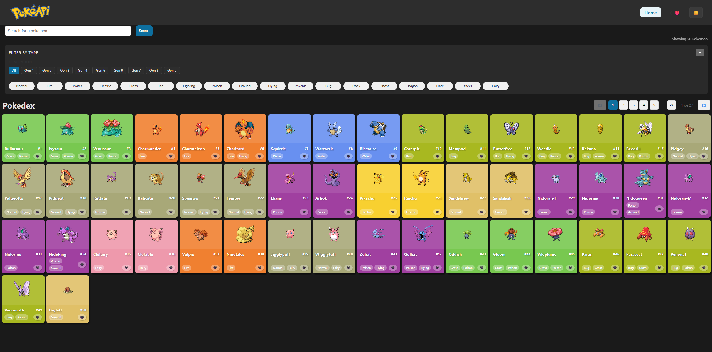

<div align="center">
  
  
  # 🎮 Pokedex
  
  A modern, feature-rich Pokemon encyclopedia built with React
  
  [](https://hudsonferraz.github.io/pokedex/)
</div>

## ✨ Features

- **Search Pokemon** - Quick search with autocomplete suggestions
- **Favorites** - Save your favorite Pokemon for easy access
- **Dark Mode** - Toggle between light and dark themes
- **Detailed Stats** - View comprehensive Pokemon statistics with radar charts
- **Compare Pokemon** - Side-by-side comparison of Pokemon stats
- **Type-based Colors** - Pokemon cards colored by their types
- **Evolution Chains** - Visual evolution paths for each Pokemon
- **Responsive Design** - Works seamlessly on desktop and mobile
- **Type & Generation Filters** - Filter Pokemon by type or generation
- **Recently Viewed** - Quick access to recently viewed Pokemon
- **Move Details** - Hover to see detailed move information

## Live Demo

Visit the live application: **[https://hudsonferraz.github.io/pokedex/](https://hudsonferraz.github.io/pokedex/)**

## Tech Stack

- **React 18.2.0** - UI library
- **React Router DOM 6.20.0** - Client-side routing
- **PokeAPI** - Pokemon data source
- **CSS3** - Styling with CSS variables for theming

## Installation

1. Clone the repository:
```bash
git clone https://github.com/hudsonferraz/pokedex.git
cd pokedex
```

2. Install dependencies:
```bash
npm install
```

## Usage

### Development
Start the development server:
```bash
npm start
```
The app will open at `http://localhost:3000`

### Build
Create a production build:
```bash
npm run build
```

### Deploy
Deploy to GitHub Pages:
```bash
npm run deploy
```

## Project Structure

```
pokedex/
├── public/          # Static assets
├── src/
│   ├── components/  # React components
│   ├── contexts/    # Context providers (Theme, Favorites, Comparison)
│   ├── utils/       # Utility functions
│   └── api.js       # PokeAPI integration
└── package.json
```

## Key Features Explained

### Dark Mode
Toggle between light and dark themes with persistent preference storage.

### Pokemon Comparison
Select two Pokemon from their detail pages to compare stats side-by-side with visual indicators.

### Type Filtering
Filter Pokemon by type across all generations with pagination support.

### Generation Filtering
Browse Pokemon by generation (Gen 1-9) with ID range filtering.

## API

This project uses the [PokeAPI](https://pokeapi.co/) - a free, open-source RESTful API for Pokemon data.

## License

This project is licensed under the MIT License - see the [LICENSE](LICENSE.txt) file for details.

## Author

**Hudson Ferraz**
- GitHub: [@hudsonferraz](https://github.com/hudsonferraz)
- Live Demo: [https://hudsonferraz.github.io/pokedex/](https://hudsonferraz.github.io/pokedex/)

---