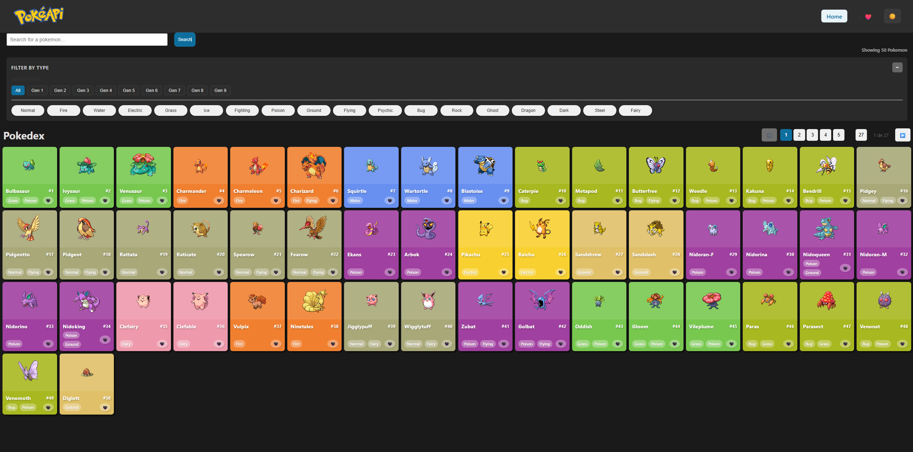
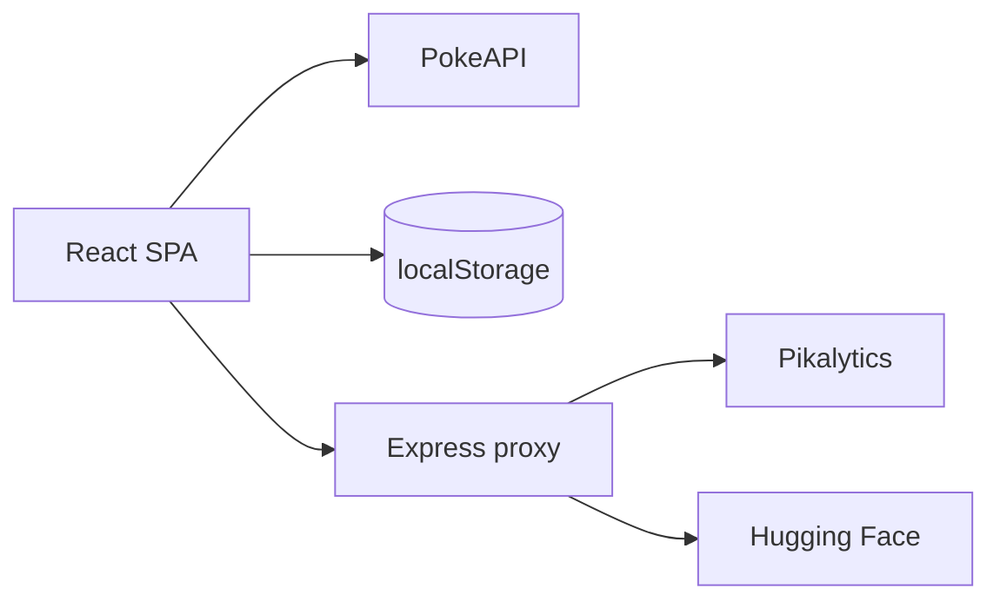

<div align="center">
  
  
  # Pokédex + VGC Team Lab
  
  Full-stack **VGC doubles** team builder with **live Pikalytics meta**, Showdown import/export, and AI coaching — default format **Pokémon Champions Reg M-A**.
  
  [](https://hudsonferraz.github.io/pokedex/)
</div>

## Live links

| Service | URL |
|---------|-----|
| Frontend (GitHub Pages) | [https://hudsonferraz.github.io/pokedex/](https://hudsonferraz.github.io/pokedex/) |
| Backend API (Render) | [https://pokedex-5p5t.onrender.com](https://pokedex-5p5t.onrender.com) |

Build with the API URL set:

```bash
set REACT_APP_API_URL=https://pokedex-5p5t.onrender.com
npm run build
```

## Architecture

**Static React on GitHub Pages + Express on Render.** The frontend stays free, fast, and token-free; the server proxies Pikalytics (markdown → JSON), holds the Hugging Face key, and caches responses for 6 hours. Teams live in `localStorage`; share links use base64 in `?team=` — no database.


```mermaid
flowchart LR
  React[React SPA] --> PokeAPI[PokeAPI]
  React --> LS[(localStorage)]
  React --> API[Express proxy]
  API --> PK[Pikalytics]
  API --> HF[Hugging Face]
```

**Key flows:** *Apply meta set* — set modal → meta service (session cache) → `/api/meta/pokemon` → parser → slot set. *AI tips* — team summary POST → `/api/ai-team-tips` → Llama 3.2 (token never in browser).

| Data | Source | Notes |
|------|--------|-------|
| Species, moves, stats | [PokeAPI](https://pokeapi.co/) | Live |
| Usage, sets, teammates, WR | Pikalytics via proxy | 6h cache; bundled fallback if offline |
| Ban / restricted | `src/data/regulations.json` | Manual — [VGC rules](https://play.pokemon.com/en-us/resources/rules/?category=vgc) |
| Speed benchmarks | `src/data/speedBenchmarks.json` | Static |

Team Builder shows a **health chip** (`GET /health`) for API and AI status. Render cold starts (~30s) fall back to bundled meta data.

## Share team links

Export → **Copy share link** encodes the team as `?team=<base64 JSON>` (name, up to 6 species, optional sets and bring-4). Opening the URL auto-imports on Team Builder. Keep payloads small (~2k URL limit); use Showdown paste for heavy sets.

## Features

- **Team lab** — 6 slots, roles, bring-4, Showdown import/export, regulation checks, share URLs
- **Live meta** — Apply meta set, partner suggestions, suggest 6th, meta gap panel, usage/WR badges
- **Analysis** — Type coverage, radar, speed tiers, preview simulator, meta opponent preset
- **AI coaching** — VGC-doubles prompt with sets, bring-4, and meta context
- **Browse** — Search, filters, detail meta panel, dark mode, favorites, compare

## Tech stack

React 18 · React Router 6 · PokeAPI · Node/Express · CSS design tokens

## Development

```bash
git clone https://github.com/hudsonferraz/pokedex.git
cd pokedex
npm install
npm start                  # frontend
npm run start:server       # optional — AI + Pikalytics proxy on :3001
```

For local meta/AI, set `REACT_APP_API_URL=http://localhost:3001`. Deploy: `npm run build` then `npm run deploy`.

## API

| Route | Purpose |
|-------|---------|
| `GET /health` | API + AI readiness |
| `GET /api/meta/usage/:format` | Format usage and cores |
| `GET /api/meta/pokemon/:format/:species` | Per-species meta set |
| `POST /api/ai-team-tips` | AI tips (HF proxy) |

## License

MIT — see [LICENSE](LICENSE.txt).

## Author

**Hudson Ferraz** — [@hudsonferraz](https://github.com/hudsonferraz)
