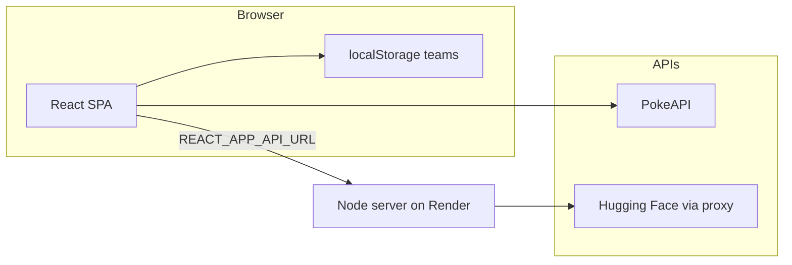

<div align="center">
  
  
  # Pokedex + VGC Team Lab
  
  React Pokédex with a doubles-focused team builder, analysis dashboard, and AI tips.
  
  [](https://hudsonferraz.github.io/pokedex/)
</div>

## Live links

| Service | URL |
|---------|-----|
| Frontend (GitHub Pages) | [https://hudsonferraz.github.io/pokedex/](https://hudsonferraz.github.io/pokedex/) |
| Backend API (Render) | [https://pokedex-5p5t.onrender.com](https://pokedex-5p5t.onrender.com) |

Build the frontend with the API URL:

```bash
set REACT_APP_API_URL=https://pokedex-5p5t.onrender.com
npm run build
```

## Architecture


```mermaid
flowchart LR
  subgraph browser [Browser]
    React[React SPA]
    LS[localStorage teams]
  end
  subgraph apis [APIs]
    PokeAPI[PokeAPI]
    HF[Hugging Face via proxy]
  end
  React --> PokeAPI
  React --> LS
  React -->|REACT_APP_API_URL| Render[Node server on Render]
  Render --> HF
```

- **Browse / detail**: React calls PokeAPI directly for Pokémon data.
- **Team builder**: Teams, movesets, and roles persist in `localStorage`.
- **AI tips**: Browser calls your Node proxy; the server holds `HUGGINGFACE_TOKEN` (never exposed to the client).

## Features

- **VGC team lab** — Hero landing, six slots, role tags (Lead / Attacker / Support…), 4-move summaries
- **Team analysis** — Collapsible dashboard, average-stats radar, type coverage bars, weakness badges
- **AI team tips** — Rule-based tips + optional Hugging Face answers (format-aware)
- **Browse** — Search, type/generation filters, skeleton loading grid
- **Dark mode** — Theme toggle with CSS variables
- **Compare Pokémon** — Side-by-side stats from detail pages
- **Share teams** — Copy text or share link (`?team=…`)

## Tech stack

- React 18, React Router 6
- PokeAPI (Pokémon data)
- Node + Express proxy (AI tips, deploy on Render)
- CSS design tokens (`src/styles/designTokens.css`, `src/constants/typeColors.js`)

## Installation

```bash
git clone https://github.com/hudsonferraz/pokedex.git
cd pokedex
npm install
```

### Development

```bash
npm start
```

Optional API proxy (for AI tips locally):

```bash
npm run start:server
```

Set `REACT_APP_API_URL=http://localhost:3001` when running the React app against the local server.

### Deploy

```bash
npm run build
npm run deploy
```

See [DEPLOYMENT.md](DEPLOYMENT.md) for Render + GitHub Pages details.

## Project structure

```
pokedex/
├── public/
├── server/              # Express proxy (AI, health)
├── src/
│   ├── components/      # UI (TeamBuilder, TeamAnalysis, …)
│   ├── constants/       # typeColors, roles
│   ├── contexts/        # Team, Theme, Comparison
│   ├── hooks/           # useModalAccessibility
│   ├── styles/          # design tokens
│   └── utils/           # team analysis, export, tips
└── package.json
```

## API

- [PokeAPI](https://pokeapi.co/) — Pokémon species, moves, stats
- Custom server — `POST` team tips (proxies Hugging Face)

## License

MIT — see [LICENSE](LICENSE.txt).

## Author

**Hudson Ferraz** — [@hudsonferraz](https://github.com/hudsonferraz)
