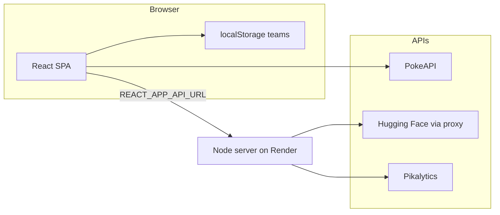

<div align="center">
  
  
  # Pokédex + VGC Team Lab
  
  Full-stack **VGC doubles** team builder with **live Pikalytics meta**, Showdown import/export, and AI coaching — default format **Pokémon Champions Reg M-A**.
  
  [](https://hudsonferraz.github.io/pokedex/)
</div>

## Live links

| Service | URL |
|---------|-----|
| Frontend (GitHub Pages) | [https://hudsonferraz.github.io/pokedex/](https://hudsonferraz.github.io/pokedex/) |
| Backend API (Render) | [https://pokedex-5p5t.onrender.com](https://pokedex-5p5t.onrender.com) |

Build the frontend with the API URL:

```bash
set REACT_APP_API_URL=https://pokedex-5p5t.onrender.com
npm run build
```

## Architecture


```mermaid
flowchart LR
  subgraph browser [Browser]
    React[React SPA]
    LS[localStorage teams]
  end
  subgraph apis [APIs]
    PokeAPI[PokeAPI]
    HF[Hugging Face via proxy]
    Pikalytics[Pikalytics]
  end
  React --> PokeAPI
  React --> LS
  React -->|REACT_APP_API_URL| Render[Node server on Render]
  Render --> HF
  Render --> Pikalytics
```

### Live vs bundled data

| Data | Source | Updates |
|------|--------|---------|
| Pokémon species, moves, stats | [PokeAPI](https://pokeapi.co/) | Automatic |
| VGC usage %, top meta, cores | Pikalytics `GET /api/meta/usage/:format` | Live; server cache 6h |
| Per-Pokémon sets, WR, teammates | Pikalytics `GET /api/meta/pokemon/:format/:species` | Live; server cache 6h |
| Ban / restricted lists | `src/data/regulations.json` | Manual — [official VGC rules](https://play.pokemon.com/en-us/resources/rules/?category=vgc) |
| Speed benchmarks | `src/data/speedBenchmarks.json` | Game mechanics |

If Pikalytics or the API is down, the app falls back to bundled `vgcUsage.json` / `vgcMeta.json` and shows **Offline fallback**.

- **Browse / detail**: PokeAPI for species; Pikalytics for usage + win rate (top meta prefetched on Browse).
- **Team builder**: Teams, sets, roles in `localStorage`; **Apply meta set** and **partner suggestions** from Pikalytics.
- **AI tips**: Node proxy holds `HUGGINGFACE_TOKEN` (never exposed to the client).

## Features

### VGC team lab
- **Champions Reg M-A** default format (+ Scarlet/Violet Reg I/J/H)
- Six slots, multiple saved teams, role tags, bring-4 preview
- **Showdown** paste import/export, damage calc deep link
- **Apply meta set** — one-click ability, item, nature, EVs, top 4 moves from Pikalytics
- **Partner suggestions** — common teammates per slot with quick **Add**
- Regulation validation (ban/restricted warnings)

### Analysis & coaching
- Collapsible analysis dashboard (radar, type coverage, move-based coverage)
- Speed tier table with Tailwind column
- Meta threat / core hints (live + bundled fallback)
- Team preview simulator (4v4 drag, type matrix)
- AI tips with VGC-doubles prompt and full team context

### Browse
- Search, type/generation filters, skeleton grid
- **Live usage %** and **win rate** badges on meta Pokémon
- Detail page **VGC meta panel** (usage, WR, partners, Pikalytics link)
- Dark mode, compare, favorites, recently viewed, share teams

## Tech stack

- React 18, React Router 6
- PokeAPI (Pokémon data)
- Node + Express proxy (AI tips, Pikalytics markdown parsers, 6h cache)
- CSS design tokens (`src/styles/designTokens.css`, `src/constants/typeColors.js`)

## Installation

```bash
git clone https://github.com/hudsonferraz/pokedex.git
cd pokedex
npm install
```

### Development

```bash
npm start
```

Optional API proxy (AI + Pikalytics meta locally):

```bash
npm run start:server
```

Set `REACT_APP_API_URL=http://localhost:3001` when running the React app against the local server.

### Deploy

```bash
npm run build
npm run deploy
```

See [DEPLOYMENT.md](DEPLOYMENT.md) for Render + GitHub Pages details.

## Project structure

```
pokedex/
├── public/
├── server/              # Express proxy (AI, Pikalytics parsers, cache)
├── src/
│   ├── components/      # TeamBuilder, VgcMetaStats, TeammateSuggestions, …
│   ├── constants/       # typeColors, pikalyticsFormats, vgcOptions
│   ├── contexts/        # Team, Regulation, MetaData, Theme
│   ├── services/        # metaDataService (live + prefetch)
│   ├── styles/          # design tokens
│   └── utils/           # team analysis, Showdown parser, regulation
└── package.json
```

## API (custom server)

| Route | Purpose |
|-------|---------|
| `GET /health` | Health check |
| `GET /api/meta/formats` | Supported Pikalytics formats |
| `GET /api/meta/usage/:formatCode` | Format usage + cores |
| `GET /api/meta/pokemon/:formatCode/:species` | Per-species meta set |
| `POST /api/ai-team-tips` | VGC AI tips (Hugging Face proxy) |

External: [PokeAPI](https://pokeapi.co/) for species data.

## Roadmap

See [PORTFOLIO_ROADMAP.md](PORTFOLIO_ROADMAP.md) for completed work and next sprints (meta gap panel, featured teams, tests/CI).

## License

MIT — see [LICENSE](LICENSE.txt).

## Author

**Hudson Ferraz** — [@hudsonferraz](https://github.com/hudsonferraz)
