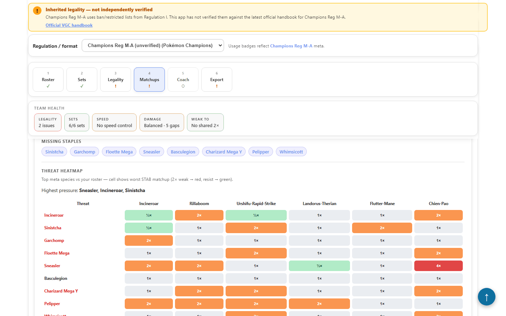
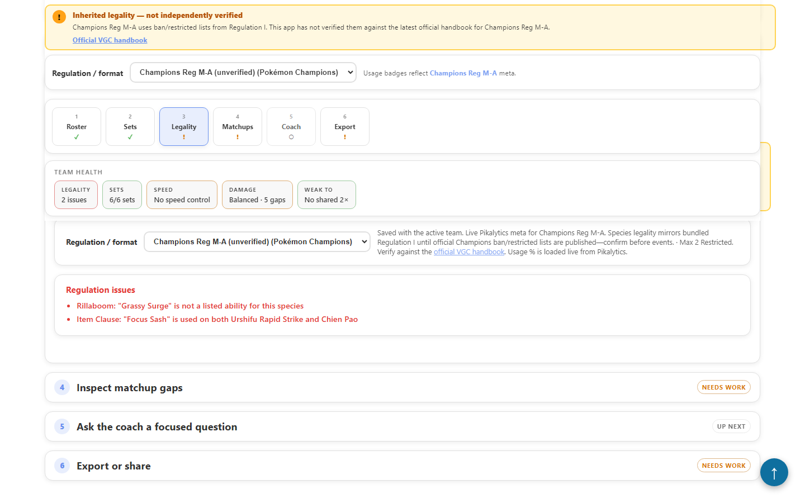
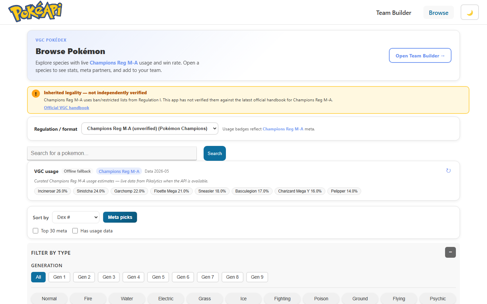
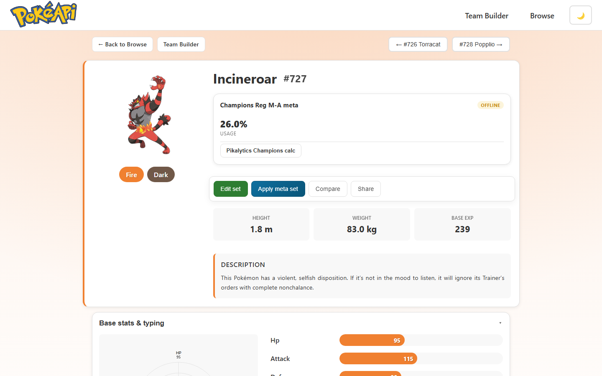
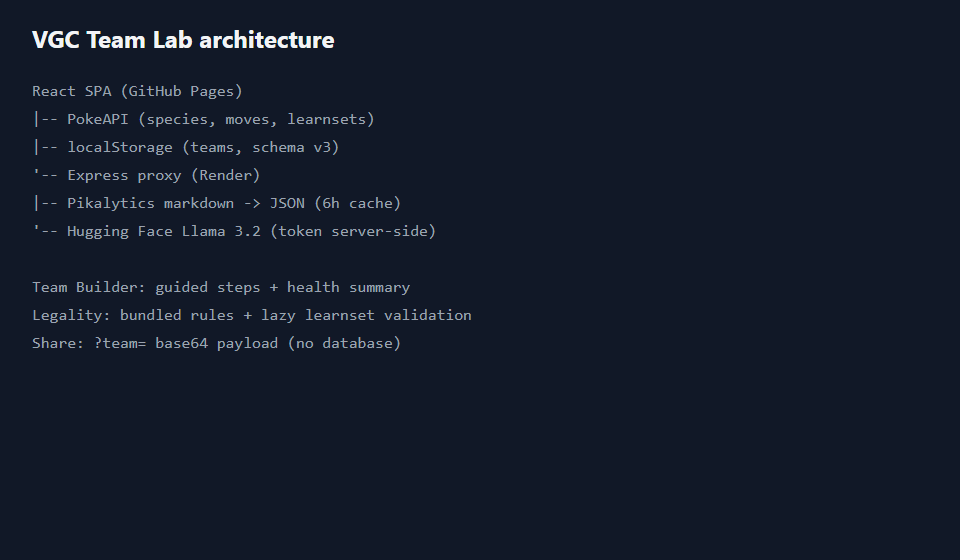

# VGC Team Lab


[](https://hudsonferraz.github.io/pokedex/)

**Full-stack VGC doubles team builder** with live Pikalytics meta, regulation legality checks, Showdown import/export, guided workflow, and AI coaching — default format **Pokémon Champions Reg M-A**.

This is a **portfolio and research project** — useful for exploring competitive team construction, meta integration, and honest legality UX. It is **not** an official Pokémon Company tool or event legality authority.

**What it does:** build six-Pokémon teams, apply ladder sets, check regulation fit, analyze matchups, export/share.  
**How it's built:** React SPA on GitHub Pages, Express proxy on Render, PokeAPI + bundled rules.  
**Scope and limits:** browser storage only, inherited legality for some formats, AI is advisory — see [Assumptions](#assumptions) and [design decisions](docs/design-decisions.md).



## Live links

| Service | URL |
|---------|-----|
| Frontend (GitHub Pages) | [https://hudsonferraz.github.io/pokedex/](https://hudsonferraz.github.io/pokedex/) |
| Backend API (Render) | [https://pokedex-5p5t.onrender.com](https://pokedex-5p5t.onrender.com) |

## Highlights

- **69 automated tests** — regulation legality, Showdown round-trip, team schema v3, build health workflow, HTTP protection, Pikalytics parser, App smoke
- **Guided Team Builder** — six-step flow (Roster → Sets → Legality → Matchups → Coach → Export) with sticky health summary and undo toasts
- **Live meta** — Pikalytics usage/sets via proxied API (6h cache) with bundled fallback when Render is cold
- **Honest legality** — per-team regulation, inherited/unverified format notices, lazy learnset validation with clear pending states
- **Showdown workflow** — import/export paste with VGC form name mapping, share links via `?team=` base64 payload
- **Protected AI route** — Hugging Face token server-side, CORS allowlist, rate limits, body validation, outbound timeouts
- **No accounts, no database** — teams in `localStorage`; API holds no user roster data

## Screenshots

| Team Builder (guided workflow) | Legality + format notice |
|------------------------------|--------------------------|
|  |  |

| Browse + meta badges | Pokémon detail |
|----------------------|----------------|
|  |  |

| Architecture |
|--------------|
|  |

## Capabilities

| Area | What you get |
|------|----------------|
| **Team lab** | 6 slots, roles, bring-4, multi-team tabs, undo, per-team regulation |
| **Sets** | Move picker, set editor, Apply meta set, Showdown import |
| **Legality** | Species clause, restricteds, items, learnsets (on demand), transparency for unverified formats |
| **Analysis** | Type coverage, speed tiers, meta gap, threat hints, preview simulator |
| **Meta** | Usage %, win rate, partner suggestions, suggest 6th |
| **Export** | Showdown paste, plain text, share URL |
| **Browse** | Search, filters, favorites, compare, dark mode |

## Quickstart (local)

Requires Node.js 18+.

```bash
git clone https://github.com/hudsonferraz/pokedex.git
cd pokedex
npm install
cp server/.env.example server/.env   # optional — AI + local proxy
npm start                            # frontend → http://localhost:3000/pokedex/
```

Optional API proxy (Pikalytics + AI on port 3001):

```bash
npm run start:server
```

Set in `.env` or shell for local meta/AI:

```bash
REACT_APP_API_URL=http://localhost:3001
```

Add `HUGGINGFACE_TOKEN` to `server/.env` for AI tips.

## Production build

```bash
set REACT_APP_API_URL=https://pokedex-5p5t.onrender.com
npm run build
npm run deploy
```

## API

| Route | Description |
|-------|-------------|
| `GET /api/health` | API liveness + whether AI token is configured |
| `GET /api/meta/usage/:format` | Format usage table and core Pokémon |
| `GET /api/meta/pokemon/:format/:species` | Per-species Pikalytics meta (parsed JSON) |
| `POST /api/ai-team-tips` | AI coaching proxy (validated body, rate-limited) |

## Architecture

See [docs/architecture.md](docs/architecture.md) for diagrams, data flows, and deployment layout.

## Assumptions

This project is a **team-building lab**, not an official VGC rules engine. Key simplifications:

### Data and storage

- **Teams are local** — `localStorage` only; clearing browser data loses teams unless exported.
- **Share links** — base64 in `?team=`; blocked above ~1800 characters; use Showdown paste for large payloads.
- **Compact roster model** — learnsets are not stored; fetched when needed for validation or editing.

### Regulation legality

- **Bundled lists** — `src/data/regulations.json` (+ ban list for Regulation H). Some formats inherit another regulation and are flagged **unverified** in the UI.
- **Not official** — always confirm against the [official VGC handbook](https://play.pokemon.com/en-us/resources/rules/?category=vgc) before events.
- **Learnset checks** — best-effort against PokeAPI learnsets; pending/unavailable states are shown explicitly.

### Meta and AI

- **Pikalytics** — markdown scraped server-side; 6-hour cache; bundled fallback if proxy is down.
- **AI tips** — Llama 3.2 via Hugging Face; rate-limited; advisory only; token never in the browser.
- **Render cold start** — free tier may take ~30s to wake; health chip and fallback meta reflect status.

### Security

- **CORS allowlist** — GitHub Pages origin + configured env URLs.
- **Rate limits** — per-IP on AI and meta routes; expired buckets pruned periodically.
- **No authentication** — open API on Render; not suitable for public abuse without additional edge protection.

For rationale behind each choice, see [docs/design-decisions.md](docs/design-decisions.md).

## Configuration

See `server/.env.example`. Key variables:

| Variable | Description |
|----------|-------------|
| `HUGGINGFACE_TOKEN` | Hugging Face API token for AI route |
| `ALLOWED_ORIGINS` | Comma-separated CORS origins |
| `AI_RATE_LIMIT_MAX` / `AI_RATE_LIMIT_WINDOW_MS` | AI requests per IP per window |
| `META_RATE_LIMIT_MAX` / `META_RATE_LIMIT_WINDOW_MS` | Meta requests per IP per window |
| `HF_FETCH_TIMEOUT_MS` | Upstream AI timeout (default 45s) |
| `PIKALYTICS_FETCH_TIMEOUT_MS` | Upstream meta timeout (default 15s) |

Frontend:

| Variable | Description |
|----------|-------------|
| `REACT_APP_API_URL` | Render or local Express base URL |

## Development

```bash
npm test -- --watchAll=false    # frontend unit tests
npm run test:server             # server unit tests
npm run build                   # production bundle
```

Regenerate portfolio screenshots and demo GIF (requires running `npm start` or set `PORTFOLIO_BASE_URL`):

```bash
npm run build:portfolio-assets
```

Optional: Python + Pillow for `demo.gif` assembly (installed automatically if `pip install pillow` is available).

## Design decisions

Extended write-up of architecture and product choices: [docs/design-decisions.md](docs/design-decisions.md).

## License

MIT — see [LICENSE.txt](LICENSE.txt).

## Author

**Hudson Ferraz** — [@hudsonferraz](https://github.com/hudsonferraz)
