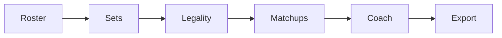

# Architecture

## Overview

VGC Team Lab is a **static React SPA** on GitHub Pages with a **thin Express proxy** on Render. Species data comes from PokeAPI; competitive meta and AI coaching go through the backend so API keys never ship to the browser. Teams persist in **localStorage** — no database, no accounts.

```mermaid
flowchart TB
  subgraph client [React SPA — GitHub Pages]
    Routes[React Router]
  TB[Team Builder]
  Browse[Browse + Detail]
  Ctx[Contexts: Team, Regulation, Meta, Theme]
    LS[(localStorage teams v3)]
  end

  subgraph external [Public APIs]
    PokeAPI[PokeAPI]
  end

  subgraph server [Express proxy — Render]
    Meta[/api/meta/*]
    AI[/api/ai-team-tips]
    Health[/api/health]
    Cache[(Pikalytics cache 6h)]
    HF[Hugging Face Llama 3.2]
  end

  subgraph bundled [Bundled JSON]
    Regs[regulations.json]
    Bench[speedBenchmarks.json]
    Fallback[vgcMeta fallback]
  end

  Routes --> TB
  Routes --> Browse
  TB --> Ctx
  Ctx --> LS
  Browse --> PokeAPI
  TB --> PokeAPI
  TB --> Regs
  TB --> Bench
  Ctx --> Meta
  Meta --> Cache
  Cache --> Pikalytics[(Pikalytics)]
  TB --> AI
  AI --> HF
  Meta --> Fallback
```

## Frontend layers

| Layer | Responsibility |
|-------|----------------|
| **Routes** | `/` Team Builder · `/browse` Pokédex · `/pokemon/:name` detail |
| **Contexts** | `TeamProvider` (roster + sets + undo) · `RegulationProvider` (per-team format) · `MetaDataProvider` (usage badges) |
| **Team Builder** | Six-step guided workflow, sticky health summary, progressive disclosure |
| **Utils** | Regulation validation, Showdown parse/export, team schema normalization, lazy learnset cache |
| **Storage** | `localStorage` key `pokemon-teams` — compact Pokémon models, schema version 3 |

### Provider nesting

```
ThemeProvider
  └── ComparisonProvider
        └── ToastProvider
              └── TeamProvider
                    └── RegulationProvider
                          └── MetaDataProvider (per regulationId)
                                └── Routes
```

`RegulationProvider` reads `regulationId` from the **active team record**, not a global setting. Browse mode keeps a separate stored preference when no team context applies.

## Team Builder workflow



`computeTeamBuildHealth()` drives step status chips (complete / attention / upcoming) from:

- Roster fill (6/6)
- Set completeness (4 moves + ability + item + nature)
- Regulation validation (species clause, restricteds, items, learnsets when loaded)
- Matchup signals (shared weaknesses, speed control, coverage gaps)

## Data flows

### Apply meta set

1. User opens set editor on a roster slot.
2. `MetaDataProvider` fetches `/api/meta/pokemon/:format/:species` (or session cache).
3. Server fetches Pikalytics markdown, parses with `pikalyticsParser.js`, caches 6 hours.
4. Suggested spread patches the slot set; move types resolve lazily via PokeAPI.

### AI coaching

1. Client builds a bounded `teamSummary` string from roster + sets + roles.
2. `POST /api/ai-team-tips` — body validated (16 KB max), rate-limited per IP.
3. Server calls Hugging Face with `HUGGINGFACE_TOKEN` (never exposed to browser).
4. Response parsed into structured tips with expandable rationale.

### Share import

1. Export encodes team as base64 JSON in `?team=`.
2. Team Builder `useEffect` decodes, fetches species from PokeAPI, calls `addTeamWithRoster`.
3. URL cleared with `replace: true` to avoid re-import on back navigation.
4. Links over ~1800 characters are blocked — Showdown paste recommended instead.

### Legality checks

1. Bundled `regulations.json` (+ `regulation-h-banned.json` for ban-only H).
2. `validateTeamForRegulation()` — species clause, restricteds, set rules.
3. Learnsets fetched on demand into session cache; UI shows honest pending/unavailable states.
4. Unverified/inherited formats show a **prominent notice** above the regulation selector.

## Backend routes

| Route | Purpose |
|-------|---------|
| `GET /api/health` | Liveness + AI token configured |
| `GET /api/meta/usage/:format` | Format usage table + cores |
| `GET /api/meta/pokemon/:format/:species` | Per-species meta markdown → JSON |
| `POST /api/ai-team-tips` | Proxied Llama 3.2 coaching |

### Protection (`httpProtection.js`)

- CORS allowlist (GitHub Pages + localhost + env overrides)
- Per-IP rate limits (AI + meta) with **expired bucket pruning**
- Request body validation and size limits on AI route
- Outbound fetch timeouts (HF 45s, Pikalytics 15s)

## Deployment

| Surface | Host | Notes |
|---------|------|-------|
| Frontend | GitHub Pages (`/pokedex/`) | `npm run build` + `gh-pages` |
| API | Render | `server/index.js`, env from `.env` |
| Data | Browser `localStorage` | No server-side team storage |

Production build sets `REACT_APP_API_URL` to the Render origin. Render free tier cold starts (~30s) — bundled meta fallback keeps browse usable offline.

## Testing

| Suite | Command | Coverage |
|-------|---------|----------|
| Frontend unit | `npm test -- --watchAll=false` | Regulation, Showdown round-trip, team model, build health, App smoke |
| Server unit | `npm run test:server` | Pikalytics parser, HTTP protection |
